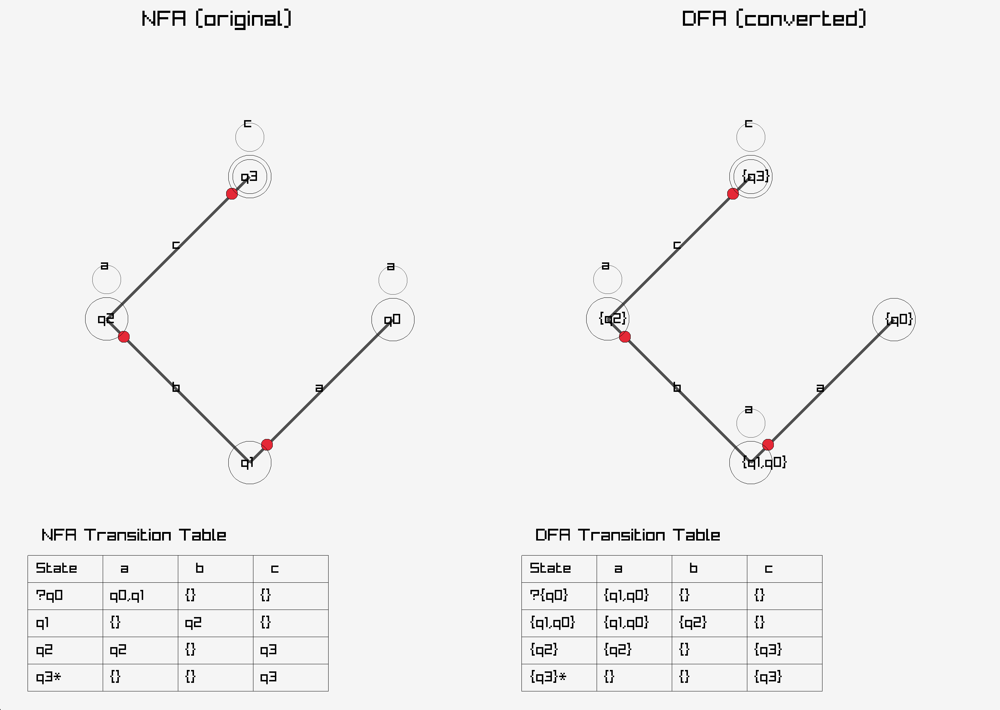

# Determinism in Finite Automata. Conversion from NDFA to DFA. Chomsky Hierarchy.

### Course: Formal Languages & Finite Automata  
### Author: Mihail Pancenco

---

## Theory

A **finite automaton** is a mathematical model that recognizes regular languages. It consists of a finite set of states, an alphabet, a transition function, a start state, and a set of final (accepting) states.

When the transition function can lead to **multiple states** for the same input symbol from one state, the automaton is **non-deterministic (NFA)**.  
If every state-symbol pair has **at most one** next state, the automaton is **deterministic (DFA)**.

Every NFA can be converted into an equivalent DFA using the **subset construction** (powerset) algorithm. The resulting DFA may have up to 2ⁿ states (where n is the number of states in the NFA).

Regular languages are located at the lowest level of the **Chomsky hierarchy** (Type-3). Regular grammars and finite automata are equivalent: any regular grammar can be converted to an FA and vice versa.

---

## Objectives

* Understand what a finite automaton is and how it models computation.
* Continue working in the same repository/project and add the following:
  * Implement conversion of a finite automaton to a regular grammar.
  * Determine whether a given FA is deterministic or non-deterministic.
  * Implement conversion from NFA to DFA (subset construction algorithm).
  * Represent the finite automaton graphically (**bonus point** – implemented with Raylib).
* (Optional) Add a function that classifies a grammar according to the Chomsky hierarchy (not required for this variant).

---

## Implementation description

The project is written in **C++23** using object-oriented design and the Raylib library for graphical output. All classes store objects via smart pointers (`std::unique_ptr`) for safe memory management.

### Core classes

* `AbstractAutomaton` – base class for both NFA and DFA.
* `NonDeterministicAutomaton` – supports multiple transitions per state-symbol pair.
* `DeterministicAutomaton` – enforces single transition per state-symbol (aborts on violation).
* `State`, `Symbol`, `Transition` – basic building blocks.
* `Grammar`, `Production`, `Word` – reused from previous lab for FA ↔ Grammar conversion.

### Key converters

```cpp
// NFA → DFA (subset construction)
std::unique_ptr<DeterministicAutomaton> ConverterNFAToDFA::convert(const NonDeterministicAutomaton* nfa);

// FA → Regular Grammar
std::unique_ptr<Grammar> ConverterAutomatonToGrammar::convert(const AbstractAutomaton* automaton);

// Grammar → NFA (reused from previous lab)
std::unique_ptr<NonDeterministicAutomaton> ConverterGrammarToAutomaton::convert(const Grammar* grammar);
```

### Determinism check

```cpp
bool NonDeterministicAutomaton::isDeterministic() const;
```

### Graphical representation (bonus)

The `Drawing` class uses **Raylib** to display:

* NFA graph (left) and DFA graph (right) with red circles marking arrow heads.
* NFA and DFA transition tables (bottom) showing:
  * `→` for start state
  * `*` for final states
  * `{}` for empty transitions
  * Multiple targets in NFA cells (e.g. `q0,q1`)

Everything is drawn statically in one window for easy comparison.

### Main execution flow (in `main()`)

```cpp
// 1. Create the NFA from Variant 20
// 2. Check determinism
// 3. Convert NFA → Regular Grammar
// 4. Convert Grammar → NFA (verification)
// 5. Convert NFA → DFA
// 6. Convert DFA → Regular Grammar (verification)
// 7. Generate words and test acceptance on all automata
// 8. Launch Raylib window with graphs + tables
```

---

## Conclusions / Screenshots / Results

The program successfully:

* Correctly identifies the given automaton as **non-deterministic**.
* Converts the NFA to an equivalent DFA using subset construction.
* Converts both automata to regular grammars and back.
* All generated words are accepted/rejected identically by the original NFA, the converted DFA, and the automata obtained from grammars.

**Console output example** (shortened):

```
Deterministic? -> NO
NFA → DFA conversion completed
Generated words tested on all automata → 100% match
```

**Visual result** (what you see when running the program):

  
*(Left: NFA graph + table | Right: DFA graph + table)*

The graphical representation clearly shows how the DFA has more states but no ambiguity.

---

## References

1. Hopcroft, J. E., Motwani, R., & Ullman, J. D. (2007). *Introduction to Automata Theory, Languages, and Computation*.
2. Raylib official documentation – https://www.raylib.com/
3. Course materials: Formal Languages & Finite Automata (Vasile Drumea, Irina Cojuhari).
4. Previous lab report (Regular Grammar → Finite Automaton).